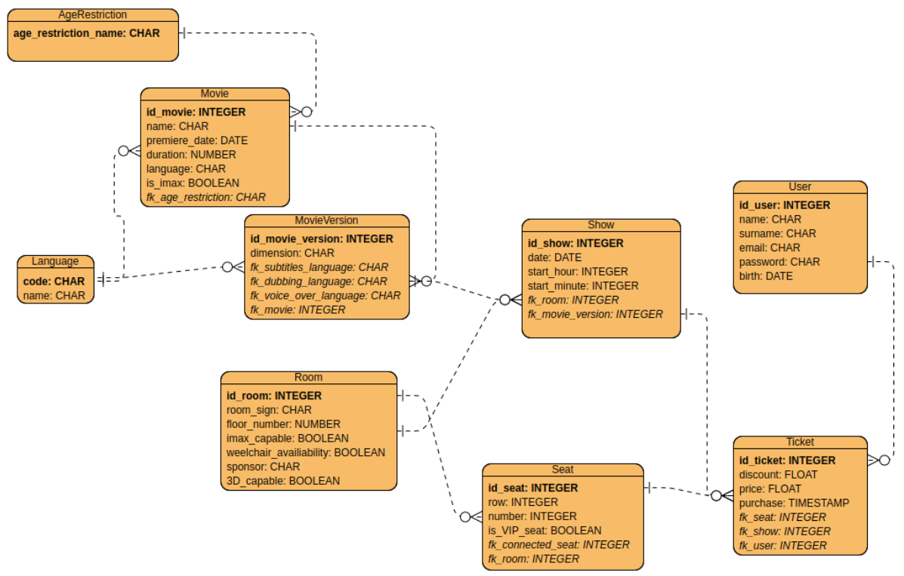

# Baza danych kina
Baza danych służy wsparciu obsługi kina. Kino to organizuje seanse filmów w swoich salach
kinowych. Na te seanse sprzedaje bilety na konkretne miejsca. Jednym z kanałów
sprzedaży biletów jest serwis internetowy. Filmy są wyświetlane w kinie w różnych wersjach
językowych i różnych wymiarach (2D, 3D). Niektóre rodzaje filmów wymagają specjalnego
wyposażenia sali. Poszczególne sale mogą mieć sponsorów tytularnych. Niektóre miejsca
na sali są na podwójnych kanapach. Specjalnie oznaczone miejsca mają podwyższoną
cenę.



# Setting up oracle database:

 >Set up container with docker:  
```docker run --name oracle -d -p 1521:1521 -e ORACLE_PASSWORD=test gvenzl/oracle-xe```  

>Set up container with podman:  
```podman run --name oracle -d -p 1521:1521 -e ORACLE_PASSWORD=test docker.io/gvenzl/oracle-xe```

## Access database:  

username: system  
password: test

## Create user: ```create_user.sql```  
username: test  
password: test

## DDL: ```create_tables.sql``` 